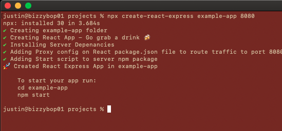

# Create React Express App

Shortcut for making react/express apps

Run the following:
`npx create-react-express <NAME OF PROJECT>`

Optionally you can supply a port number for the express server. By default, this port is set to 3001
_(Note: Port can not be 3000)_

#### Example

`npx create-react-express example-project 8080`

